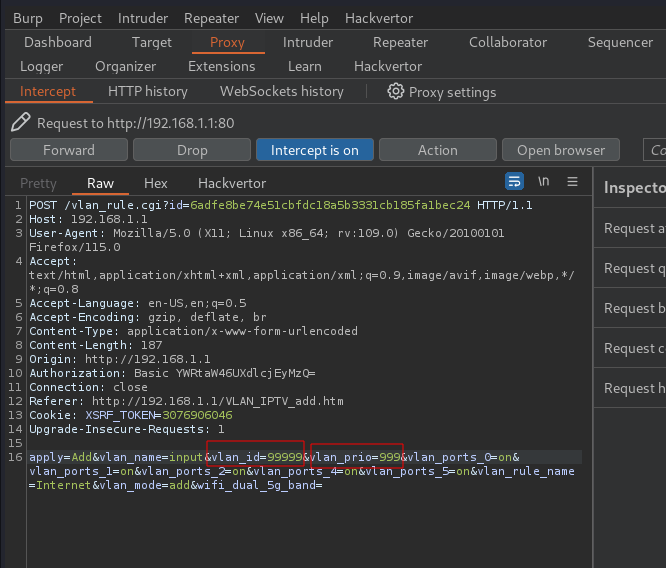

**
Report of Additional Weaknesses (Under Review)

Note: I'm about to publish a writeup that was previously delayed due to bug bounty rules. 

    Command Injection Post-Authentication: It has been identified that, subsequent to a successful authentication, an attacker is capable of injecting commands into the POST request parameters. This vulnerability potentially allows the attacker to gain unauthorized shell privileges.

    Unauthenticated Remote Access Vulnerability: There exists a weakness whereby a remote attacker can access certain pages without the need for any authentication. 
**

# Vulnerability Description
Netgear R6250 router is vulnerable to malicious input after authentication.

potentially leading to unexpected system behavior.

## Basic Information
* CVE-ID:
* Vendor: Netgear
* Product: R6250
* Firmware version: R6250-V1.0.4.48_10.1.30.zip

## Firmware Analysis
Firmware download: `https://www.netgear.com/support/download/?model=R6250`

Extract it directly using binwalk with the option -Me.

## Code Analysis

To extract data directly using Binwalk with the option `-Me`, use the `-Me` flag in Binwalk. This option allows you to quickly extract embedded files from a binary file without additional steps or tools.

Analyzing the binary file `/usr/sbin/httpd`, in the function FUN_00081a80, the values of `vlan_id` and `vlan_prio` is obtained from FUN_00016b04 (URLdecode) without proper input sanitization.
FUN_00017bd0 (Navigate to page).

 <!-- Add this line to insert the decompiler image -->

Set up the router environment through FirmAE.

 <!-- Add this line to insert the environment image -->

 <!-- Add this line to insert the VLAN_IPTV image -->

 <!-- Add this line to insert the WrongPriority image -->

 <!-- Add this line to insert the WrongVLAN_ID image -->

 <!-- Add this line to insert the result image -->

A potential PoC is shown below:

## Vulnerability Fix

Treated and sanitized the input
